# Insurance Analysis

## Introduction

This project aims to address the evolving needs of insurance companies, agents, and policyholders by leveraging advanced technologies and data-driven insights. By streamlining policy administration, claims processing, customer interactions, and data analytics, the Insurance Management System Project seeks to optimize operational workflows, reduce processing times, minimize errors, and facilitate better decision-making.

## Agenda
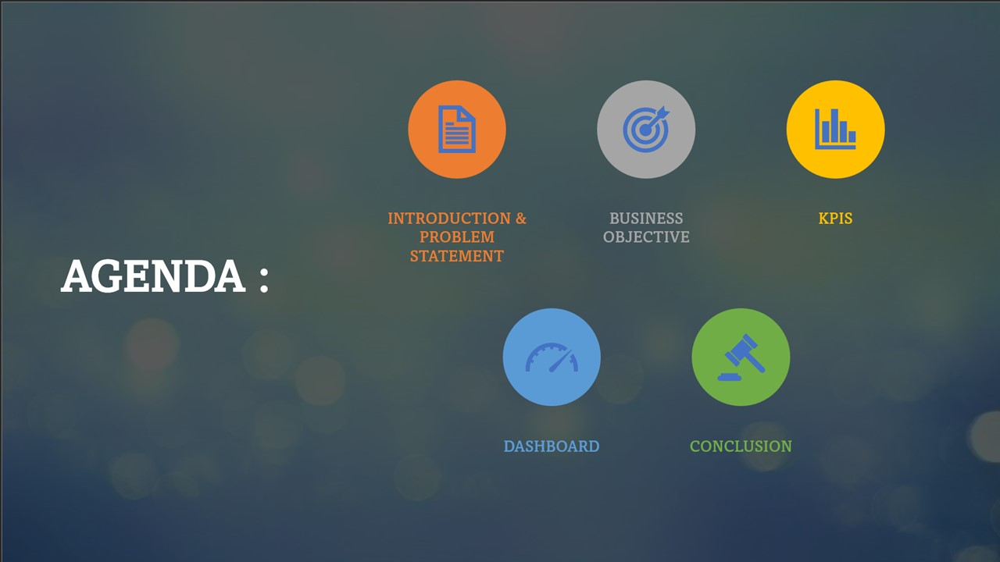

## Problem Statement
 -	Number of Invoice by Account Executive
 - 	Yearly meeting count
 -  Cross sell- Target, Achieve, New
 -  New- Target, Achieve, New
 -  Renewal- Target, Achieve, New
 -  Stage funnel by revenue
 -  Number of meeting by account executive
 -  Top 4 open oppurtunity

### Objective
The aim of this project is to analyze insurance retention and branch team with the organization and provide insights to the branch team for developing effective retention strategies. Through data analysis and visualizations, we will identify factors that contribute to:

- Risk Assessment and Mitigation
- Operational Efficiency and Cost Optimization
- Market Expansion and Growth Strategies
- Evaluate the effectiveness of existing retention strategies
- Increase the meeting frequency
- Evaluate as a partner in meeting client needs
- Contribute to the overall success of our organization

### Dataset  
-	Project Name: Insurance Analysis
- Dataset Name: Total 2 files
- Dataset Type: Xlsx Data
- Dataset Size: Each CSV file has 7k+ records

## Skills/ Concepts Demonstrated
- The following skills were incorporated:
   - Excel (pivot tables, charts, conditional formatting, VBA Macros, Slicers, Power Pivot)
   - MySQL (Joins, Group by, Having, Window Functions, View, Aggregate Functions)
   - Power BI (Bookmarking, DAX, Quick Measures, Page Navigations, Modelling, Filters, Tooltips)
   - Tableau (Joins, Custom Charts, Calculated Field, parameters, actions, filters, buttons, annotations)
 
  ## Modelling
Created a bridge table to deal with many to many relationsships. Bridge table used to get unique values between two tables

 Data Model                                                                                                      |
:---------------------------------------------------------------------------------------------------------------:|
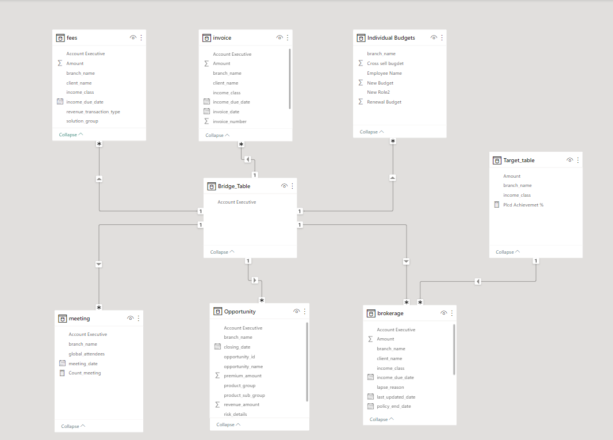                                                                                 |  

## KPI's Overview and Features 

1. Number of invoice by account executive

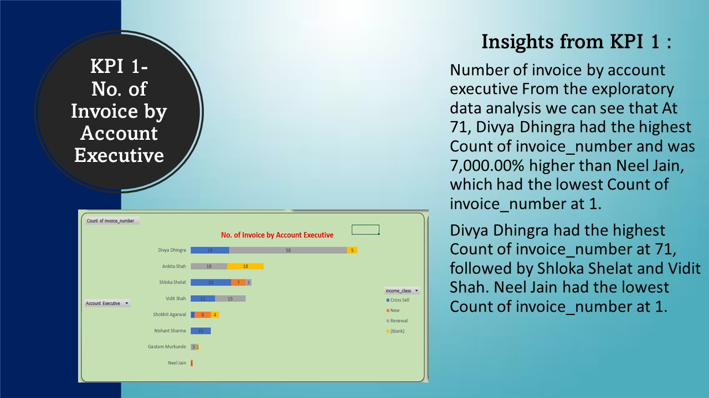

It is reported that we can see that At 71, Divya Dhingra had the highest Count of invoice_number and was 7,000.00% higher than Neel Jain, which had the lowest Count of invoice_number at 1.

suggestions to improve the invoices thus increase in sales:
- Review and optimize your internal processes for creating, sending, and managing invoices 
- Implement efficient workflow systems and automation tools to reduce manual work and minimize errors
- Invest in marketing and sales efforts to attract new clients
- Develop targeted marketing campaigns, establish partnerships with brokers or agents, and offer competitive packages to draw in more customers

2. Yearly Meeting Count

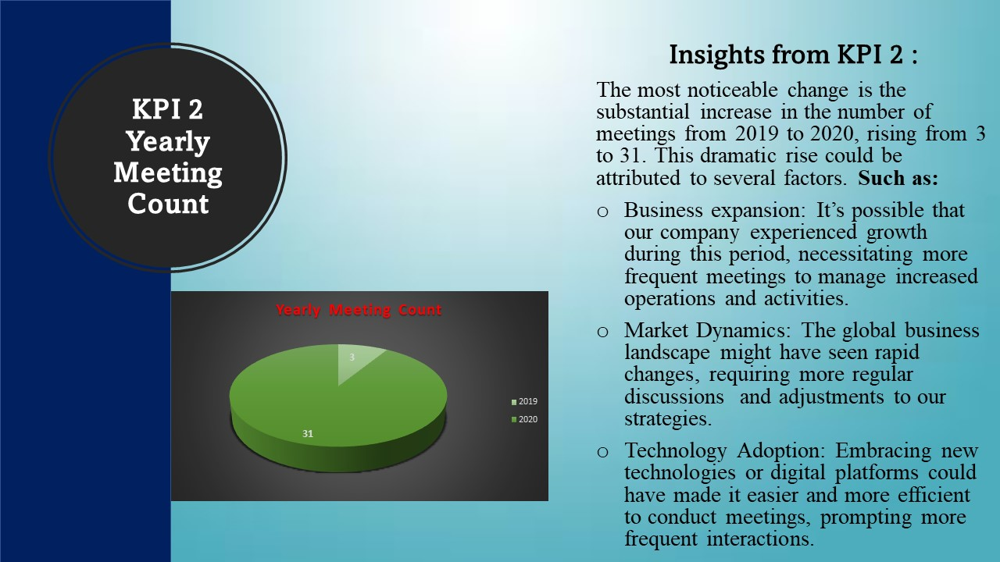

We observed varying levels of meeting activity among our account executives. Some held a higher number of meetings, while others had a more moderate approach.

While the increase in meeting frequency between 2019 and 2020 indicates a dynamic and responsive approach to business conditions, it’s essential to strike a balance between effective communication and operational efficiency. By implementing the suggested strategies, we can optimize our meeting practices and ensure that every interaction contributes meaningfully to our company’s success.

3. Cross Sell--Target,Achive,new

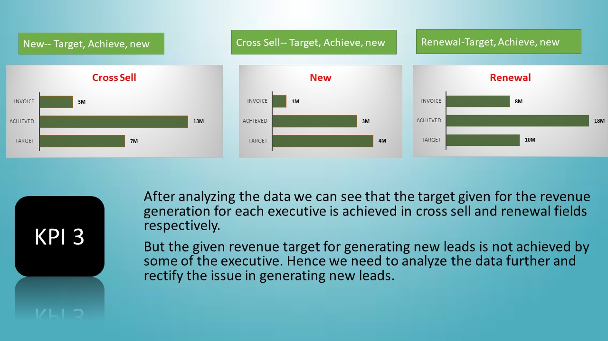

Leverage advanced data analytics to gain a comprehensive understanding of customer profiles, behaviors, and needs
This data-driven approach will enable the company to tailor its cross-selling efforts, target new prospects effectively, and optimize renewal strategies
Conduct thorough market research to identify potential customer segments with unmet insurance needs or underserved markets
Hosting webinars, workshops, or seminars related to insurance topics that are of interest to your target audience
Participating in industry events, trade shows, and community gatherings to showcase expertise and connect with potential customers

 

4. Stage Funnel By Revenue

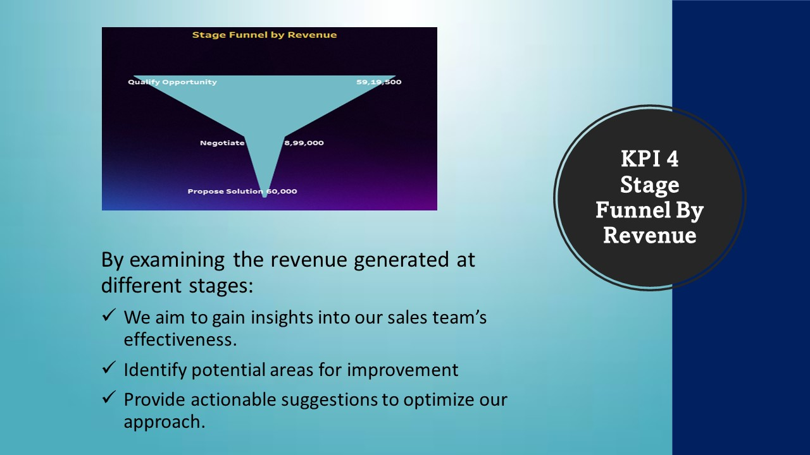

- While the “qualify Opportunity” stage is robust, the “Negotiate” and “propose solution” stages offer untapped potential for revenue optimization
- By strategically addressing challenges
- Refining our approach
- We can drive higher revenue conversion and strengthen client relationships
- This strategic approach will not only enhance our financial performance but also reinforce our position as a trusted partner in meeting client needs

5. Number of meetings by account executive

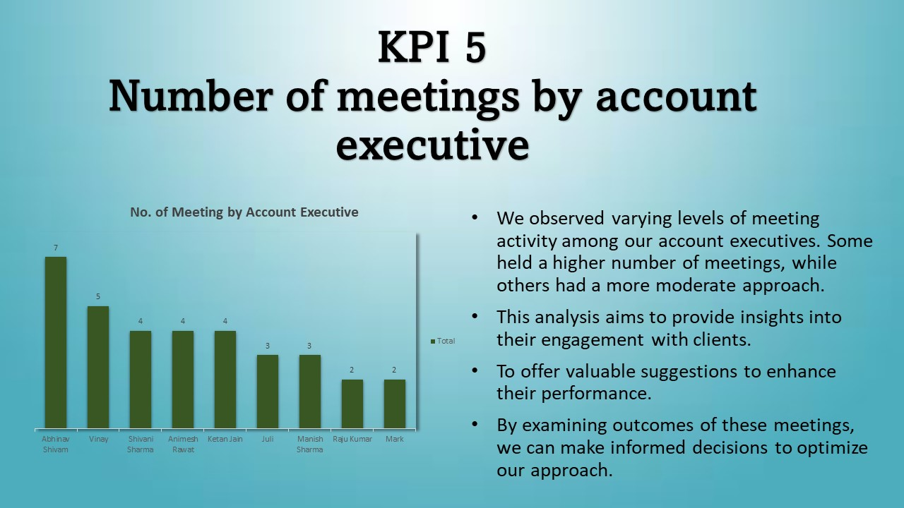

- From this analysis and implementing the suggested enhancements, we are poised to elevate the overall meeting effectiveness of our account executives.
- This will not only lead to improved client relationships but also contribute to the overall success of our organization.

6. Top Open Opportunity

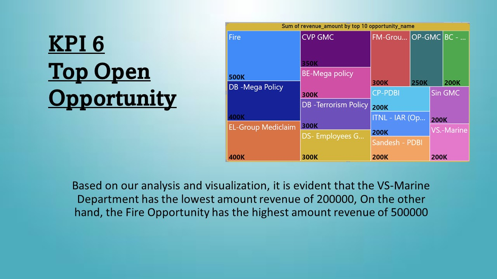

- These findings underscore the importance of strategically focusing on high-revenue opportunities, such as the Fire Opportunity, to drive organizational growth and achieve financial objectives. 
- Additionally, addressing the revenue gaps in the VS-Marine Department presents an opportunity for targeted interventions and improvements to enhance revenue generation in that particular sector. 
- Overall, leveraging these insights and taking appropriate actions can significantly contribute to the overall success and profitability of the organization.

## Analysis & visualizations
The Report Comprises 3 Dashboards:

 1. Excel Dashboard

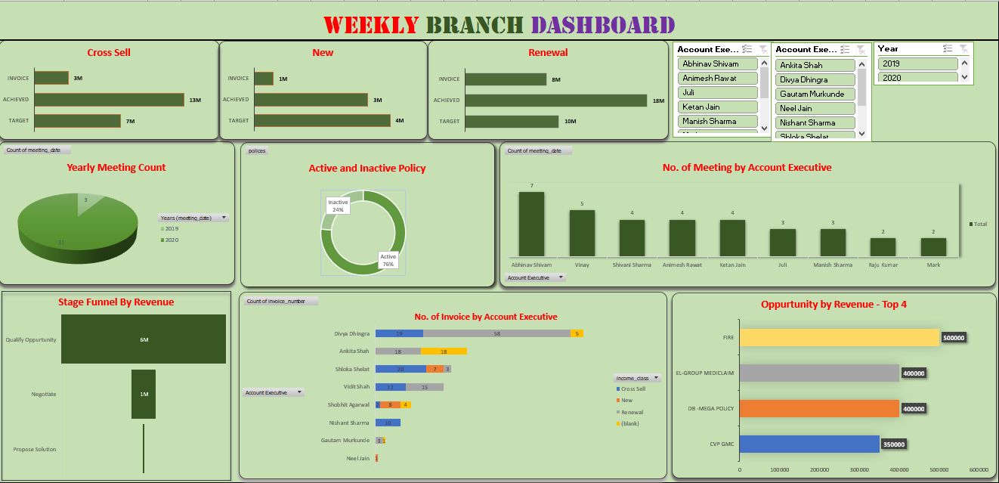

2. Tableau Dashboard

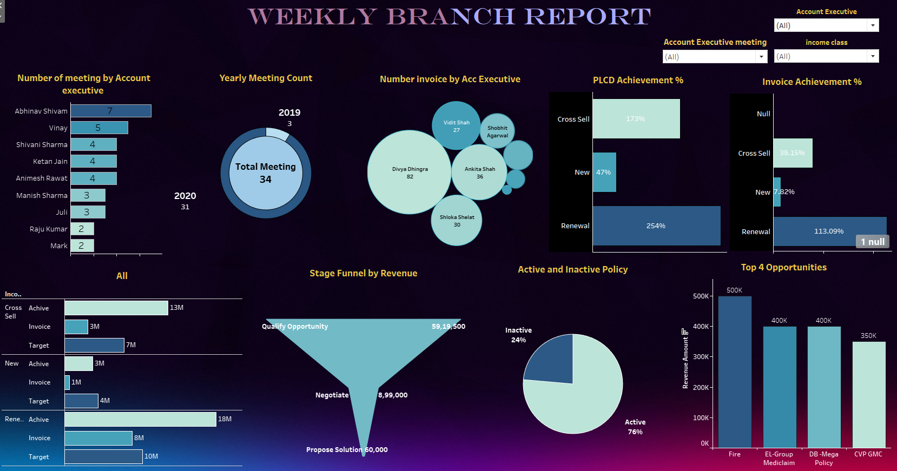

3. Power BI Dashboard

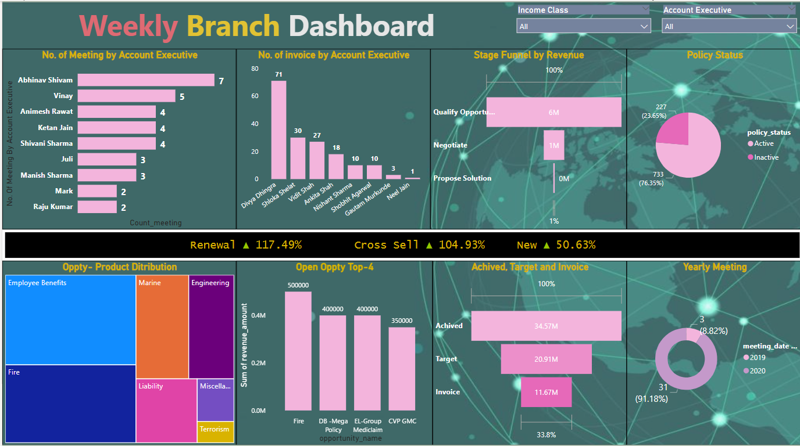

## Conclusion 

- While the increase in meeting frequency between 2019 and 2020 indicates a dynamic and responsive approach to business conditions, it’s essential to strike a balance between effective communication and 
  operational efficiency. By implementing the suggested strategies, we can optimize our meeting practices and ensure that every interaction contributes meaningfully to our company’s success.
- This data-driven approach will enable the company to tailor its cross-selling efforts, target new prospects effectively, and optimize renewal strategies
- While the “qualify Opportunity” stage is robust, the “Negotiate” and “propose solution” stages offer untapped potential for revenue optimization.
- From this analysis and implementing the suggested enhancements, we are poised to elevate the overall meeting effectiveness of our account executives.
  
## Recommendations

- Participating in industry events, trade shows, and community gatherings to showcase expertise and connect with potential customers.
- Conduct thorough market research to identify potential customer segments with unmet insurance needs or underserved markets.
- Review and optimize your internal processes for creating, sending, and managing invoices. Implement efficient workflow systems and automation tools to reduce manual work and minimize errors:
- Invest in marketig and sales efforts to attract new clients. Develop targeted marketing campaigns, establish partnerships with brokers or agents, and offer competitive packages to draw in more 
  customers.
  

##  Recommendation:

To enhance your insurance analysis, consider implementing predictive modeling techniques. By leveraging historical data, predictive models can forecast future insurance retention rates, identify at-risk policies, and help in proactively retaining clients. This can lead to more informed decision-making and improved customer satisfaction.

